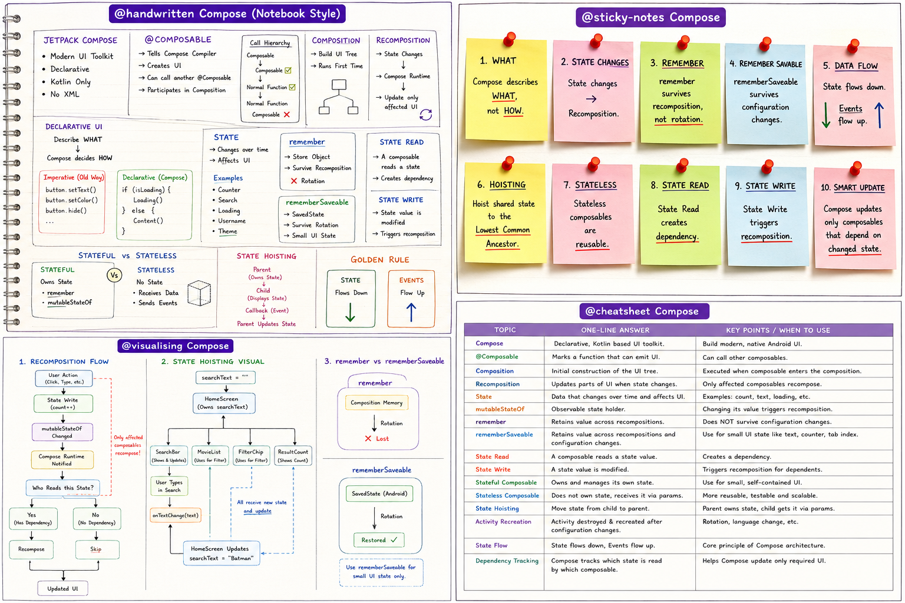

# Master Jetpack Compose Interview Questions

Why is @Composable an annotation?
- @Composable is an annotation that tells the Compose Compiler that this function describes a part of the UI. The compiler generates additional code so the function can participate in Composition and Recomposition.

Why didn't Google create a new keyword instead of an annotation?
* Because annotations allow the Compose Compiler Plugin to identify UI functions at compile time and transform them without changing the Kotlin language itself.

Can a normal function call a composable?
* No. A normal Kotlin function cannot call a composable because it is not part of the Compose Runtime. Only another composable can call a composable.

Why?
-Because composable functions require the Compose Compiler to generate additional runtime information (such as the Composer  parameter), which normal functions do not have.

Can a composable call a normal function?
* Yes. A composable is still a Kotlin function, so it can call normal Kotlin functions whenever needed.

Should we call Repository or API directly from a composable?
* No. Business logic and data fetching should be handled by the ViewModel. The composable should only display UI based on state.

What is the role of the Compose Compiler?
- The Compose Compiler identifies functions marked with @Composable and transforms them into code that works with the Compose Runtime. It generates additional parameters and logic so the function can participate in Composition, Recomposition, and efficient UI updates.

Easy Memory Trick
Remember this sentence:

@Composable -> Compose Compiler -> Compose Runtime -> UI

Whenever someone asks:
"What does the Compose Compiler do?"

Immediately think:
Normal Function -> Transforms -> Composable Function -> Works with Runtime

What is Composition?
* Composition is the process where the Compose Runtime executes composable functions for the first time and builds the UI tree. This is called the Initial Composition.

Follow-up
Interviewer:
Does Composition happen only once?
Expected answer:
No. Initial Composition happens once when the composable enters the Composition. After that, whenever state changes, Compose performs Recomposition for the affected composables.

What is Recomposition?
* Recomposition is the process where the Compose Runtime re-executes only the composables affected by state changes, updating only the necessary parts of the UI.

What triggers Recomposition?
* State changes trigger recomposition. Compose observes state objects, and when a state value changes, it schedules recomposition for the composables that read that state.

Follow-up
Interviewer:
Does every state change recompose the whole screen?
Expected answer:
No. Compose recomposes only the composables that read the changed state.

Why doesn't Compose redraw the whole screen?
* Compose tracks which composables read a particular state. When that state changes, it recomposes only those composables instead of rebuilding the entire screen.

Is Recomposition good or bad?
* Recomposition is a normal and essential part of Compose. It keeps the UI in sync with state. However, unnecessary recompositions can affect performance and should be minimized.

What is Initial Composition?
* Initial Composition is the first execution of a composable when it enters the Composition. During this process, Compose builds the initial UI tree.

How do you think Compose knows that only the counter text should change instead of rebuilding the whole screen?
* Compose keeps track of which composables read a state value. When that state changes, Compose schedules recomposition only for those composables instead of recomposing the entire UI tree.

If only WelcomeMessage changes?
* Only WelcomeMessage() composables reexecute and update UI.
  However, depending on parameters and stability, Compose may also invoke HomeScreen() to determine what changed, while still skipping children that don't need updates.
  This is why you'll sometimes hear:
  "Compose can invoke a parent composable but skip unchanged child composables."

Real Interview Scenario
Interviewer:
Why is Compose called a Declarative UI framework?
A strong answer:
Because in Compose we describe what the UI should look like for a given state instead of manually updating individual UI elements. When the state changes, Compose automatically recomposes the affected parts of the UI.
That's a solid mid-to-senior level answer.

Ultimate Memory Trick
Remember this sentence:
Imperative = Tell the UI what to do.(How)
Declarative = Tell the UI what to be. (What)
XML -> HOW
Compose -> WHAT

What is Imperative UI?
* Imperative UI is an approach where the developer manually tells the system how to update the UI step by step. Every UI change, such as updating text or changing visibility, must be handled explicitly.

What is Declarative UI?
- Declarative UI is an approach where we describe what the UI should look like for the current state. When the state changes, the framework automatically updates the UI.

Why is Compose called Declarative?
* Compose is called declarative because we describe the UI based on state instead of manually updating individual UI elements. When the state changes, Compose automatically recomposes the affected UI.

Follow-up Interview Question
Interviewer:
Why don't we manually refresh the screen in Compose?
Expected answer:
Because Compose observes state changes. When observable state changes, it automatically schedules recomposition for the affected composables.

What is the role of State in Declarative UI?
* State is the single source of truth in Compose. Composables read state, and whenever that state changes, Compose recomposes the affected UI to reflect the new state.

Why is Compose easier to maintain than XML?
* UI is always consistent with state.
* Smaller reusable composables improve readability.
* Less chance of forgetting a UI update.

Why don't we call setText() in Compose?
- In Compose, UI is generated from state instead of manipulating Views directly. When the state changes, Compose automatically updates the displayed text, so methods like setText() are unnecessary.

What are the advantages of Declarative UI over Imperative UI?
*  Less boilerplate
*  Fewer manual UI updates
*  Easier maintenance
*  Better readability
*  UI stays synchronized with state
*  Kotlin-only UI development
*  Reusable composables

Interview Challenge (Senior Level)
Suppose an interviewer asks:
"If Compose is declarative, why do we still need Recomposition?"

How would you answer?
Take a moment to think before reading the expected answer.

A strong answer would be:
Because state can change over time. Declarative UI describes what the UI should look like for the current state, and Recomposition is the mechanism Compose uses to update only the affected parts of the UI whenever that state changes.

Notice how Declarative UI describes the programming model, while Recomposition is the runtime mechanism that makes it work.

What is State?
* State is any data that can change over time and affects what is displayed on the UI.
* e.g Counter, Username, loading

Why doesn't a normal variable update the UI?
* A normal variable is not observable. Compose doesn't know when its value changes, so it doesn't trigger recomposition.

What is mutableStateOf?
- mutableStateOf creates an observable state object. When its value changes, Compose is notified and schedules recomposition for composables that read that state.

What is remember?
- remember stores an object in the Composition so it survives recomposition instead of being recreated every time.

Why do we need both remember and mutableStateOf?
- remember preserves the state across recompositions, while mutableStateOf makes the state observable so Compose can trigger recomposition when it changes.

What happens if remember is removed?
- Then state value doesn’t store and every time it new state created and old value gets reset.

What happens if mutableStateOf is removed?
- Then state object won’t be observable object and it doesn’t trigger recomposition.

Does remember survive screen rotation? (Just guess—we'll learn the exact answer later.)
- I guess no.

## **Level 2**
### Lesson 6 - State Reads, State Writes & The Recomposition Cycle

What is a State Read?
* A State Read occurs when a composable accesses the value of an observable state object. Compose records this dependency so it knows which composables depend on that state.

What is a State Write?
* A State Write occurs when the value of an observable state object is modified. This notifies the Compose Runtime, which may schedule recomposition for dependent composables.

How does Compose know which composables depend on a state?
* Compose records which composables read a particular state. When that state changes, the Compose Runtime uses those recorded dependencies to schedule recomposition for the affected composables.

Why doesn't every composable recompose?
* Because Compose tracks state reads. Only composables that have read the changed state become candidates for recomposition. Unaffected composables can be skipped.

Can multiple composables read the same state?
- Yes mutiple composable can read the same state.

If two composables read the same state and that state changes, what happens?
- Then compose schedules recompostion for those two composables and provide updated UI.

What is the difference between reading state and writing state?
* State Read means a composable accesses a state value, allowing Compose to record the dependency. State Write means the state value is modified, which notifies the Compose Runtime and may trigger recomposition.

### Lesson 7  - remember vs rememberSaveable

Your Compose counter resets every time the user rotates the phone. How would you debug it, identify the cause, and fix it?
* First, verify where the counter state is stored.
* If it's using remember, I know it only survives recomposition, not Activity recreation.
* Screen rotation recreates the Activity, so the Composition is recreated and the remembered state is lost.
* If this is temporary UI state like a counter or search text, replace remember with rememberSaveable.
* If the state belongs to the screen's business logic or comes from an API, move it to a ViewModel instead.

Why does remember lose its value after screen rotation?
- Remember stores state value in current composition when initially actiivity created. So after screen rotation current activity  gets destroyed and new activity created so new compostion happens so previous value remeber looses.

What is Activity recreation?
* Activity recreation is the process where Android destroys the current Activity and creates a new instance because of a configuration change (such as screen rotation or language change).

What is rememberSaveable?
- RememberSavable stores value in android saved state and survies configuration changes.

How is rememberSaveable different from remember?
- remeberSavable survies both recomposition and  configuration change and remember survies only recomposition.

Should API responses be stored using rememberSaveable? Why?
- No API reponses should not be stored using rememberSavable.
* API data is usually large.
* It belongs to the business/data layer.
* rememberSaveable is intended for small UI state.
* ViewModel is the appropriate place because it survives configuration changes and separates UI from business logic.

Name five examples where rememberSaveable is a good choice.
* Search text
* Selected tab
* Current page in a pager
* Counter value
* Form input (name, email)
* Selected filter
* Scroll position

Can rememberSaveable save every object? If not, why?
- It cannot automatically save every object. It supports types that Android's saved state can handle. For custom objects, you need to provide a Saver or use another appropriate state holder.

### Lesson 8  - Stateful vs Stateless Composables(State Hoisting)

What is a Stateful Composable?
* A Stateful Composable owns and manages its own state internally.

What is a Stateless Composable?
- Statelss Composables doesn’t own state and it receives data through parameters and communicates through events callback

What is State Hoisting?
* State Hoisting is the process of moving state ownership from a child composable to its parent composable, passing state down and events back up through callbacks.

Why does Google recommend Stateless Composables?
- Because it doesn’t own any state so it can reusable and help in making consistent UI
- Reusable
- Easier to test
- Better separation of concerns
- Easier to maintain

Explain the sentence: "State flows down, Events flow up."
- State flows down - pass state from parent to child in downward direction
- Events flow up - when event happen then callback executed in upward direction

Should every state be hoisted? Why or why not?
* No. Small UI-only state such as password visibility, animation progress, or expanded/collapsed state can remain inside the composable. Hoist state only when it needs to be shared or controlled by a parent.

Give three examples where state should remain inside a composable.
* Password visibility
* Expanded card
* Tooltip visibility
* Animation state
* Dropdown expanded state

Give three examples where state should be hoisted.
* Search query shared with a movie list
* Login form (username & password managed by the parent)
* Selected tab used by multiple composables
* Current page in a pager
* Shopping cart quantity displayed in multiple places

### Compose Rule #2

You learned your first important Compose rule yesterday:

State flows down, Events flow up.

Here's the second one:

State should be owned by the Lowest Common Ancestor (LCA) of every composable that needs it.

